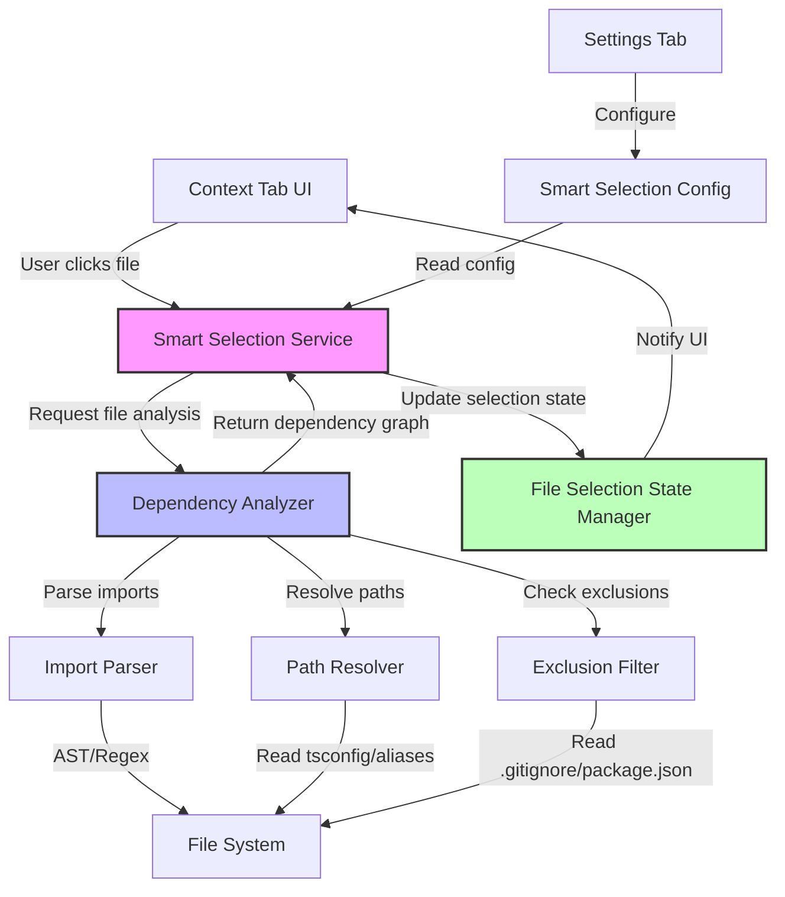
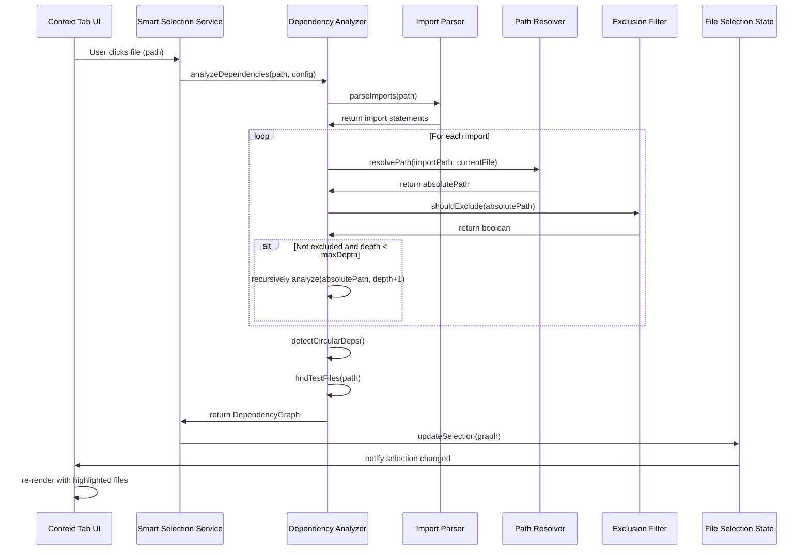

# System Design & Architecture

## 🏗️ Design Summary

**Architecture Pattern**: Service-oriented with BFS graph traversal  
**Core Services**: ImportParser → PathResolver → DependencyAnalyzer → SmartSelectionService  
**Communication**: Message passing between Extension Host ↔ Webview  
**Data Structure**: Dependency graph with nodes, edges, reverse edges, cycle detection

**Key Technical Decisions:**

- ✅ **BFS over DFS**: Better depth control, easier progress tracking
- ✅ **Hybrid parsing**: Regex (fast) with AST fallback (accurate)
- ✅ **Eager analysis**: On user click, with caching for performance
- ✅ **Dual UI**: Settings Tab (config) + Context Tab (quick toggle)

**Performance Targets:**

- P95: < 500ms for files with < 20 imports
- P99: < 3s for complex files (50+ imports)
- Memory: < 50MB for typical dependency graphs

**Non-Functional Requirements:**

- ✅ Security: No code execution, path traversal prevention
- ✅ Scalability: Works with 5,000+ file projects
- ✅ Reliability: Graceful degradation on errors

---

## Architecture Overview

**What is the high-level system structure?**



### Key Components

1. **Smart Selection Service** (New)

   - Orchestrates the smart selection workflow
   - Manages async operations and state updates
   - Communicates between UI and core analysis logic

2. **Dependency Analyzer** (New)

   - Core engine for analyzing file dependencies
   - Implements graph traversal algorithms
   - Detects circular dependencies
   - Respects max depth configuration

3. **Import Parser** (New)

   - Parses TypeScript/JavaScript files for import statements
   - Supports ES6, CommonJS, dynamic imports
   - Extracts import paths for analysis

4. **Path Resolver** (New)

   - Resolves relative imports to absolute workspace paths
   - Handles TypeScript path mappings (tsconfig paths)
   - Resolves barrel exports (index.ts)

5. **Exclusion Filter** (New)

   - Checks if file should be excluded
   - Reads .gitignore patterns
   - Checks node_modules and package.json dependencies
   - Applies user-defined exclusion patterns

6. **File Selection State Manager** (Enhanced)

   - Extends existing selection state
   - Tracks auto-selected vs manual-selected files
   - Provides methods to query selection metadata

7. **Smart Selection Config** (New)
   - Stores user preferences
   - Max depth, enabled/disabled state
   - Exclusion patterns
   - Test file patterns

### Technology Stack

- **Language**: TypeScript
- **Parser**: `@typescript-eslint/typescript-estree` or custom regex-based parser
- **File System**: VS Code `workspace.fs` API
- **Graph Algorithm**: Breadth-First Search (BFS) for dependency traversal
- **Config Storage**: VS Code workspace/user settings
- **UI**: Existing React components with new toggle controls

## Data Models

**What data do we need to manage?**

### Core Entities

#### 1. DependencyNode

```typescript
interface DependencyNode {
  // Absolute path to the file
  path: string;

  // Import paths found in this file (relative or absolute)
  imports: string[];

  // Resolved absolute paths of imported files
  resolvedImports: string[];

  // Test files associated with this file
  testFiles: string[];

  // Depth level in dependency graph (0 = root)
  depth: number;

  // Selection metadata
  selectionType: "manual" | "auto-dependency" | "auto-test";

  // Whether this file is excluded
  isExcluded: boolean;
  excludeReason?: "node_modules" | "gitignore" | "third-party" | "user-defined";
}
```

#### 2. DependencyGraph

```typescript
interface DependencyGraph {
  // Map of file path to DependencyNode
  nodes: Map<string, DependencyNode>;

  // Adjacency list for quick traversal (forward dependencies: A→B)
  edges: Map<string, Set<string>>;

  // Reverse edges for reverse dependency lookup (who imports this file)
  // NOTE: Built for future features, NOT used for auto-selection in this phase
  // Decision: Users want dependencies OF file, not WHO uses it
  reverseEdges: Map<string, Set<string>>;

  // Root files (manually selected)
  roots: Set<string>;

  // Circular dependency cycles detected
  cycles: string[][];
}
```

#### 3. SmartSelectionConfig

```typescript
interface SmartSelectionConfig {
  // Enable/disable smart selection
  enabled: boolean;

  // Max recursion depth (0 = unlimited, -1 = disabled)
  maxDepth: number;

  // Include test files
  includeTests: boolean;

  // Test file patterns
  testFilePatterns: string[];

  // Additional exclusion patterns (glob)
  exclusionPatterns: string[];

  // Exclude third-party packages
  excludeThirdParty: boolean;

  // Respect .gitignore
  respectGitignore: boolean;
}
```

#### 4. FileSelectionMetadata

```typescript
interface FileSelectionMetadata {
  // Is file selected
  isSelected: boolean;

  // How was it selected
  selectionType: "manual" | "auto-dependency" | "auto-test";

  // Which root file caused this auto-selection (for auto-selected files)
  selectedBy?: string;

  // Depth from root
  depth: number;

  // Timestamp of selection
  selectedAt: Date;
}
```

### Data Flow



## API Design

**How do components communicate?**

### Extension Host APIs (Backend)

#### SmartSelectionService

```typescript
class SmartSelectionService {
  /**
   * Analyzes dependencies for a given file and returns dependency graph
   */
  async analyzeDependencies(
    filePath: string,
    config: SmartSelectionConfig,
  ): Promise<DependencyGraph>;

  /**
   * Auto-selects files based on dependency graph
   */
  async autoSelectDependencies(
    rootPath: string,
    currentSelection: Set<string>,
  ): Promise<SelectionUpdate>;

  /**
   * Clears auto-selections when user deselects a root file
   */
  clearAutoSelections(
    rootPath: string,
    currentSelection: Set<string>,
  ): SelectionUpdate;
}

interface SelectionUpdate {
  added: string[]; // Files to add to selection
  removed: string[]; // Files to remove
  metadata: Map<string, FileSelectionMetadata>;
}
```

#### DependencyAnalyzer

```typescript
class DependencyAnalyzer {
  /**
   * Analyzes file and builds dependency graph
   */
  async analyze(
    filePath: string,
    maxDepth: number,
    visited?: Set<string>,
  ): Promise<DependencyGraph>;

  /**
   * Finds test files for given source file
   */
  findTestFiles(filePath: string, patterns: string[]): Promise<string[]>;

  /**
   * Detects circular dependencies in graph
   */
  detectCycles(graph: DependencyGraph): string[][];
}
```

#### ImportParser

```typescript
class ImportParser {
  /**
   * Parses file and extracts import statements
   */
  async parseImports(filePath: string): Promise<ImportStatement[]>;

  /**
   * Checks if file is a supported type for parsing
   */
  isSupportedFile(filePath: string): boolean;
}

interface ImportStatement {
  source: string; // Import path as written in code
  type: "es6" | "commonjs" | "dynamic";
  specifiers: string[]; // What's being imported
  line: number;
}
```

### Webview APIs (Frontend)

#### Message Types

```typescript
// Webview → Extension
interface GetDependenciesMessage {
  command: "getDependencies";
  payload: {
    filePath: string;
    requestId: string;
  };
}

interface ToggleSmartSelectionMessage {
  command: "toggleSmartSelection";
  payload: {
    enabled: boolean;
  };
}

// Extension → Webview
interface DependenciesResponseMessage {
  command: "dependenciesResponse";
  requestId: string;
  graph: DependencyGraph;
  error?: string;
}

interface SmartSelectionStatusMessage {
  command: "smartSelectionStatus";
  enabled: boolean;
  config: SmartSelectionConfig;
}
```

## Component Breakdown

**What are the major building blocks?**

### Backend Services (Extension Host)

#### 1. `/src/services/smart-selection-service.ts`

- Main orchestrator for smart selection feature
- Handles async workflow and state management
- Coordinates between analyzer, filter, and state manager

#### 2. `/src/services/dependency-analyzer.ts`

- Core dependency analysis logic
- Graph traversal algorithms (BFS)
- Circular dependency detection
- Test file discovery

#### 3. `/src/services/import-parser.ts`

- Parses TypeScript/JavaScript files
- Extracts import statements
- Supports multiple import styles

#### 4. `/src/services/path-resolver.ts`

- Resolves import paths to absolute workspace paths
- Handles tsconfig path mappings
- Resolves aliases and barrel exports

#### 5. `/src/services/exclusion-filter.ts`

- Determines if file should be excluded
- Reads .gitignore, package.json
- Applies exclusion patterns

### Frontend Components (Webview)

#### 1. `/src/webview-ui/src/components/context-tab/smart-selection-toggle.tsx`

- Toggle button for enabling/disabling smart selection
- Shows current status
- Quick access control in Context Tab

#### 2. `/src/webview-ui/src/components/settings-tab/smart-selection-settings.tsx`

- Configuration UI for smart selection
- Max depth slider
- Test pattern inputs
- Exclusion pattern editor

#### 3. `/src/webview-ui/src/components/context-tab/file-explorer/row-decorations.tsx` (Enhanced)

- Visual indicators for auto-selected files
- Different icons/colors for manual vs auto selections
- Tooltips showing selection reason

### Utilities

#### 1. `/src/utils/graph-algorithms.ts` (New)

- BFS traversal
- Cycle detection
- Graph utilities

#### 2. `/src/utils/pattern-matcher.ts` (New)

- Glob pattern matching
- Test file pattern matching
- Exclusion pattern matching

## Design Decisions

**Why did we choose this approach?**

### Decision 1: BFS vs DFS for Dependency Traversal

**Choice**: Breadth-First Search (BFS)

**Rationale**:

- BFS naturally respects depth limits (level by level)
- Easier to show progress (files at depth N, then N+1)
- More intuitive for users (direct deps first, then transitive)
- Better for short-circuiting when max depth reached

**Alternatives Considered**:

- DFS: Would be simpler to implement recursively, but harder to limit depth
- Topological Sort: Overkill for this use case, BFS sufficient

### Decision 2: AST Parsing vs Regex for Import Extraction

**Choice**: Hybrid approach - Try AST parser, fallback to regex

**Rationale**:

- AST parsing is more accurate and reliable
- But parsing is slower and may fail on syntax errors
- Regex is fast and works on syntactically invalid code
- Best of both worlds: accuracy when possible, resilience when needed

**Alternatives Considered**:

- Pure AST: Too slow, fails on invalid syntax
- Pure Regex: Less accurate, may miss edge cases
- No parsing (use language server): Would require complex LSP integration

### Decision 3: Eager vs Lazy Dependency Analysis

**Choice**: Eager analysis when user clicks file

**Rationale**:

- User expects immediate response to their action
- Dependency graph is relatively small (< 100 files typically)
- Analysis is fast enough (< 3 seconds for large graphs)
- Caching can optimize repeated analyses

**Alternatives Considered**:

- Lazy (on-demand): Would delay context generation
- Pre-compute entire workspace: Too slow on startup, memory intensive

### Decision 4: Selection State Storage

**Choice**: Store metadata alongside selection state in existing FileSelectionState

**Rationale**:

- Leverages existing state management
- No additional state synchronization needed
- Metadata travels with selection state naturally

**Alternatives Considered**:

- Separate metadata store: Would require synchronization
- Store in graph: Graph is transient, state needs persistence

### Decision 5: UI Placement for Toggle

**Choice**: Both in Settings Tab (persistent config) and Context Tab (quick toggle)

**Rationale**:

- Settings Tab: Full configuration options, persistence
- Context Tab: Quick enable/disable for current session
- Two locations serve different user needs

**Alternatives Considered**:

- Only Settings: Too many clicks to toggle frequently
- Only Context Tab: No place for detailed configuration

## Non-Functional Requirements

**How should the system perform?**

### Performance Targets

#### Response Time

- **P95**: Dependency analysis completes in < 500ms for files with < 20 imports
- **P99**: Dependency analysis completes in < 3s for complex files (50+ imports)
- **UI Responsiveness**: UI never freezes; use async/await and progress indicators

#### Resource Usage

- **Memory**: Peak memory usage < 50MB for dependency graph (typical codebase)
- **CPU**: Analysis runs in background without blocking extension host
- **File I/O**: Batch file reads to minimize I/O operations

### Scalability Considerations

- **Large Codebases**: Must work efficiently on projects with 5,000+ files
- **Deep Dependencies**: Handle dependency chains up to 10+ levels
- **Concurrent Operations**: Support multiple analyses if user clicks rapidly
- **Caching**: Cache parsed imports to avoid re-parsing unchanged files

### Security Requirements

- **File Access**: Only access files within workspace boundaries
- **Code Execution**: Never execute code from analyzed files
- **Path Traversal**: Validate and sanitize all file paths
- **User Input**: Sanitize user-defined patterns to prevent ReDoS attacks

### Reliability/Availability Needs

- **Error Handling**: Gracefully handle parser failures, missing files, permission errors
- **Fallback**: If analysis fails, don't break existing manual selection
- **Logging**: Log errors for debugging without exposing sensitive info
- **Recovery**: Allow user to disable smart selection if causing issues
